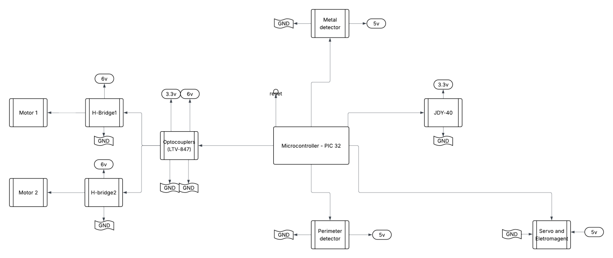

# 🪙 Coin Picking Robot — ELEC291/292 Final Project

> Autonomous & remote-controlled coin-collecting robot built with JDY-40 wireless communication, STM32 and PIC32 microcontrollers, and full electromechanical integration.

---

## 🚀 Project Overview

This project was designed and developed as part of ELEC291/292 at UBC. The robot operates in both **manual** and **automatic** modes to detect and collect Canadian coins within a predefined perimeter. It utilizes a JDY-40 UART wireless module for communication between the remote and the robot. The entire system integrates hardware PWM control, real-time motor and servo actuation, and metal/perimeter detection.

---

## 👨‍💻 Team Members

| Name            | Role             |
|-----------------|------------------|
| Hanryck Brar    | Project Lead     |
| Guocheng Cao    | Servo Mechanism  |
| Gavin Gao       | Software Lead    |
| Peter Gao       | Hardware Lead    |
| Jamie Kang      | Debugging        |
| Jacob Park      | Autocode System  |

---

## 🧩 Features

- 🧲 **Metal Detection** using a Colpitts Oscillator.
- ⚙️ **Electromagnetic Coin Picker** with dual micro servo control.
- 🚘 **Auto & Manual Navigation Modes**.
- 🧭 **Perimeter Detection** via dual-orthogonal detectors.
- 🔊 **Signal Feedback** through buzzer and LCD.
- 📡 **JDY-40 UART Wireless Link** between STM32-based controller and PIC32 robot.
- 🔋 Fully **battery-powered**, modular design.

---

## 📐 System Architecture

### 🔧 Hardware Block Diagram

---

## 💻 Software Architecture

### Controller (`controller.c` - STM32)

- Reads joystick and button states.
- Maps analog inputs to PWM-duty commands.
- Displays frequency feedback on LCD.
- Sends control signals to the robot via UART.

### Robot (`robot.c` - PIC32)

- Parses commands from controller.
- Handles two operating modes:
  - **Manual**: reacts to joystick and button input.
  - **Automatic**: follows a perimeter, detects and picks coins autonomously.
- Reads sensor data and controls motors/servos in real-time.
- Measures oscillator frequency to detect metal presence.
- Responds with detection frequency for buzzer scaling on remote.

---

## 🛠️ Hardware Components

| Component              | Description                             |
|------------------------|-----------------------------------------|
| PIC32MX130             | Robot MCU (MIPS architecture)           |
| STM32L051              | Controller MCU (ARM architecture)       |
| JDY-40                 | Wireless UART module                    |
| Electromagnet Kit      | Coin pickup via magnetic attraction     |
| Servo Motors (2x)      | Coin picker motion                      |
| GM4 Gear Motors (2x)   | Robot mobility                          |
| Colpitts Oscillator    | Metal detection via LC circuit          |
| Perimeter Detector     | Dual peak detector inputs (ADC)         |
| LCD Display            | Visual feedback on controller           |
| PS2 Joystick           | Manual control interface                |
| Buzzer                 | Audio feedback of detection strength    |

---

## 🎮 Controls

### Manual Mode:
- **Joystick**: movement (X/Y mapped to motor PWM).
- **Coin Button**: triggers the servo pickup sequence.
- **Auto Button**: switch to automatic coin-picking.

### Automatic Mode:
- Robot:
  - Searches for coins while avoiding perimeter.
  - Uses metal detector feedback to pick coins.
  - Stops after collecting 20 coins.

---

## 🎥 Demo Video

▶️ **[Watch the final demonstration on YouTube](https://www.youtube.com/watch?v=vz9sd-pzkyY)**

---

## 📝 Project Reflections

### Challenges:
- Reliable UART syncing under real-time ISR timing.
- PWM control precision across multiple motors/servos.
- Power isolation to reduce motor noise interference.

### Future Improvements:
- Upgrade to hardware PWM for all motors/servos.
- Implement obstacle detection using IR/ultrasonic sensors.
- Add coin classification with weight/diameter sensors.

---

## 🧠 Learnings

- Embedded UART synchronization with ISRs.
- Practical application of servo timing via software PWM.
- Use of inductive sensing and analog peak detection.
- Interfacing STM32 and PIC32 under real-time constraints.

---

## 📚 References

- ELEC291/292 Course Material – UBC
- JDY-40 Datasheets and configuration docs
- STM32L0 and PIC32MX130 datasheets
- Microchip AN-3001 Optocoupler Application Notes

---
